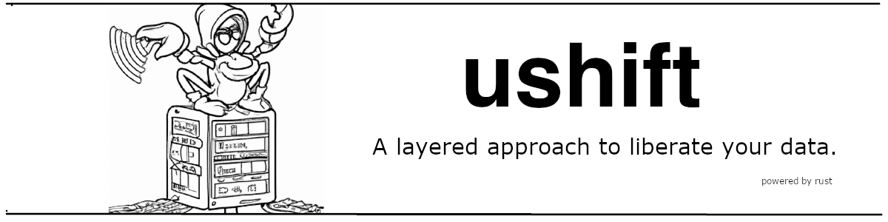

[![Build Status][build-status]][build-url]
[![Crates.io][crates-badge]][crates-url]
[![MIT licensed][mit-badge]][mit-url]

[crates-badge]: https://img.shields.io/crates/v/ushift.svg
[crates-url]: https://crates.io/crates/ushift
[mit-badge]: https://img.shields.io/badge/license-MIT-blue.svg
[mit-url]: https://github.com/plabayo/ushift/blob/main/LICENSE
[build-status]: https://github.com/plabayo/ushift/actions/workflows/CI.yml/badge.svg?branch=main
[build-url]: https://github.com/plabayo/ushift/actions/workflows/CI.yml

[Website](https://ushift.dev) |
[API Docs](https://docs.rs/ushift)

A set of libraries to help you fetch, extract and transform data. It is:

* **Fast**: Zero-cost abstractions built on top of the [Tokio](https://github.com/tokio-rs/tokio/) ecosystem;
* **Useful**: Individually for a specific purpose or as a whole to write a complete data extraction pipeline;
* **Scalable**: Run your data extraction pipeline anywhere and everywhere.

A Free and Open Source project actively researched and developed by [Plabayo.tech](https://www.plabayo.tech/).

> **WARNING**: this project is a wild west research project, use at your own risk.
> You can contact [glen@plabayo.tech](mailto:glen@plabayo.tech) if you want to get involved.

## Dreams

The following (non-functional) scripts show the direction that we want to follow
and what we would like to achieve in the end.

### Data Extraction Pipeline

> Status: ❌

```
TODO
```

### Pure Rust Proxy

> Status: ❌

```
TODO
```

### Browserless Chromium

> Status: ❌

```
TODO
```

### Google Chrome Support

> Status: ❌

```
TODO
```

## Safety

These crates uses `#![forbid(unsafe_code)]` to ensure everything is implemented in
100% safe Rust.

> The exception is [ushift-chrome](ushift-chrome) as we bind there to C++ code using CXX.

## Minimum supported Rust version

`ushift`'s MSRV is 1.60.

## Contributing

:balloon: Thanks for your help improving the project! We are so happy to have
you! We have a [contributing guide][contributing] to help you get involved in the
`ushift` project.

## License

This project is licensed under the [MIT license][license].

### Contribution

Unless you explicitly state otherwise, any contribution intentionally submitted
for inclusion in `ushift` by you, shall be licensed as MIT, without any
additional terms or conditions.

[contributing]: https://github.com/plabayo/ushift/blob/main/CONTRIBUTING.md
[license]: https://github.com/plabayo/ushift/blob/main/ushift/LICENSE
